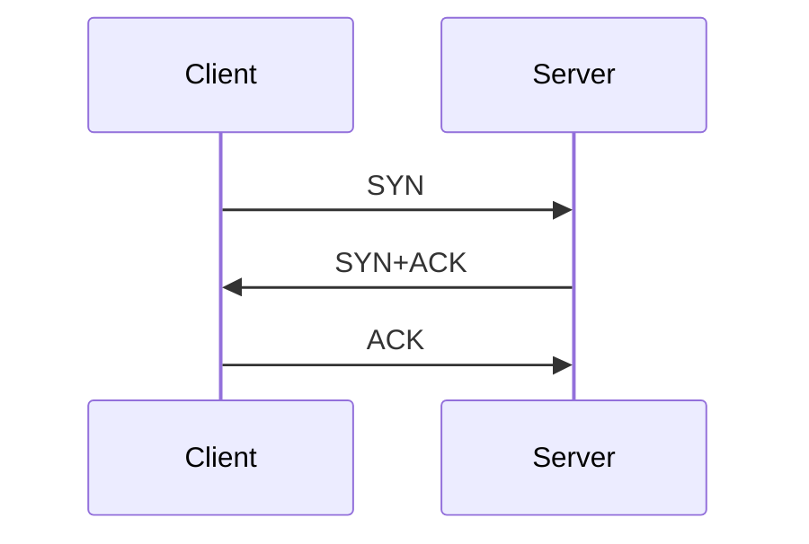

# Learned
### Networking
- Three-way Handshake  

# A Few Details  
### Three-way handshake  
#### Diagram  

#### Details  
The three-way handshake is a process used by TCP to establish a connection between two devices. It is a sequence of three steps that takes place before data transmission can begin. Here's how the three-way handshake works:

1. SYN (Synchronize): The initiating device (often referred to as the client) sends a TCP packet with the SYN flag set to the destination device (often referred to as the server). This packet indicates the desire to establish a connection and includes an initial sequence number.
2. SYN-ACK (Synchronize-Acknowledge): Upon receiving the SYN packet, the destination device responds with a TCP packet that has both the SYN and ACK (acknowledge) flags set. This packet acknowledges the receipt of the initial SYN packet and also includes its own initial sequence number.
3. ACK (Acknowledge): Finally, the initiating device acknowledges the SYN-ACK packet by sending an ACK packet back to the destination. This packet confirms the establishment of the connection and typically contains an incremented sequence number.

Once the three-way handshake is complete, the connection is established, and both devices are ready to exchange data. The sequence numbers exchanged during the handshake are used to ensure that data is transmitted and received in the correct order.

In summary, TCP is a reliable, connection-oriented protocol that guarantees delivery of data, while UDP is a simpler, connectionless protocol that does not provide the same level of reliability. The three-way handshake is a process used by TCP to establish a connection between devices, involving the exchange of SYN, SYN-ACK, and ACK packets.